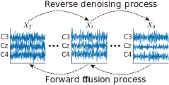

</img>

## Denoising Diffusion Probabilistic Model for EEG Generation, in Pytorch 

Implementation of <a href="https://arxiv.org/">Enhanced BCI Performance using Diffusion Model for EEG Generation</a> in Pytorch. This implementation was inspired by <a href="https://arxiv.org/abs/2006.11239">Denoising Diffusion Probabilistic Model</a>.

## Install

```bash
$ pip install denoising_diffusion_pytorch
```

## Usage
```python
import os
import torch
from denoising_diffusion_pytorch import Unet1D, GaussianDiffusion1D, Trainer1D, Dataset1D
import h5py
import numpy as np
import scipy.io as io

#model define
model = Unet1D(
    dim = 64,
    dim_mults = (1, 2, 4, 8),
    channels = 32  # This is your channel number.
)

diffusion = GaussianDiffusion1D(
    model,
    seq_length = 128*5, # It should be changed according to the Fs and task duration.
    timesteps = 1000,
    objective = 'pred_v'
)

dataset = Dataset1D(EEGdata)  # EEGdata for the left-hand MI or the right-hand MI.
trainer = Trainer1D(
   diffusion,
   dataset = dataset,
   train_batch_size = 800,
   train_lr = 8e-5,
   train_num_steps = 10000,         # total training steps
   gradient_accumulate_every = 2,    # gradient accumulation steps
   ema_decay = 0.995,                # exponential moving average decay
   amp = True,                       # turn on mixed precision
   results_folder = f'./results',
)
trainer.train()
```
## Citation
Yucun Zhong, Lin Yao, Yueming Wang, “Enhanced BCI Performance Using Diffusion Model for EEG Generation,” in 2024 46th Annual International Conference of the IEEE Engineering in Medicine and Biology Society (EMBC), Jul. 2024.


## Acknowledgment
We thank Jonathan Ho et al for their wonderful works.
```bibtex
@inproceedings{NEURIPS2020_4c5bcfec,
    author      = {Ho, Jonathan and Jain, Ajay and Abbeel, Pieter},
    booktitle   = {Advances in Neural Information Processing Systems},
    editor      = {H. Larochelle and M. Ranzato and R. Hadsell and M.F. Balcan and H. Lin},
    pages       = {6840--6851},
    publisher   = {Curran Associates, Inc.},
    title       = {Denoising Diffusion Probabilistic Models},
    url         = {https://proceedings.neurips.cc/paper/2020/file/4c5bcfec8584af0d967f1ab10179ca4b-Paper.pdf},
    volume      = {33},
    year        = {2020}
}
```
